# BWB-M1 "Specter": Conceptual Design of a Supersonic Strike Fighter

*Team of 3 · AE 405 Aircraft Design · Izmir University of Economics · Spring 2026*

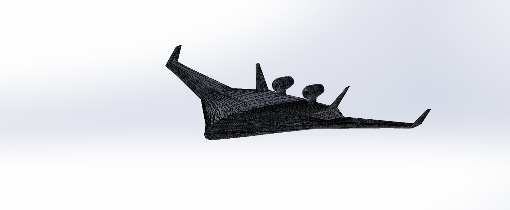

## Engineering question
Can a blended wing body (BWB), adapted from the Boeing X-48 geometry, meet the requirements of a two-seat supersonic strike fighter: Mach 2.0 maximum speed, a 14 deg/s sustained turn rate, a 12.2 km service ceiling and the design mission range?

## Approach
First-order conceptual design following **Raymer's semi-empirical conceptual design method** (*Aircraft Design: A Conceptual Approach*, 6th ed.), with the rubber-engine approach:

- **Mission analysis and fuel fractions:** 13-segment combat strike mission (about 1,000 nm ground range); segment weight fractions from Raymer's fixed historical values or the Breguet range/endurance equations.
- **Takeoff weight sizing:** fixed-point iteration of Raymer's sizing equation, using the jet-fighter empty-weight regression with a composite correction Kcomp = 0.95.
- **Wing geometry:** X-48 planform adapted (leading-edge sweep increased from 47° to 58°, outer-panel t/c = 0.04 with a NACA 64A-204 airfoil, twin all-moving vertical stabilizers, dorsal engine pods).
- **Propulsion:** two GE F110-GE-132 class afterburning turbofans (144.6 kN AB thrust each).
- **Aerodynamics:** Raymer component drag buildup for CD0, induced-drag factor and maximum L/D.
- **Performance:** takeoff, climb and specific excess power, service ceiling, maximum speed (Ackeret thin-wing wave drag with an empirical body correction), sustained turn rate, and a T/W vs W/S constraint diagram.
- **Weight breakdown:** Raymer statistical group weights for jet fighters.
- **Geometry and model:** an online Boeing X-48 STL model was adapted in SolidWorks (engines resized, vertical stabilizers added, surfaces cleaned, rescaled) and prepared for 3D printing.

## Results
| Parameter | Computed | Requirement | Status |
|:--|:--|:--|:--|
| Mission range (internal fuel) | 1,000 nm | 1,000 nm | Met |
| Maximum speed (level flight) | Below M 2.0 (wave-drag failure) | M 2.0 | **Not met** |
| Sustained turn rate (M 0.9, 6,100 m) | 14.5 deg/s | 14 deg/s | Met |
| Service ceiling | Far above 12,200 m | 12,200 m | Met |

Other key figures from the report:
- Fuel-fraction product Wff = 0.686; fuel fraction Wf/W0 = 0.333.
- Maximum takeoff weight W0 = 14,963 kg (32,988 lb); empty-weight fraction 0.575.
- CD0 = 0.00813 and (L/D)max = 17.0 at subsonic cruise (M 0.85), a direct benefit of the large BWB planform.
- T/W = 1.97 with afterburner at MTOW; stall speed about 40 kt.

**Why Mach 2.0 fails.** At M 2.0 and 12,200 m, wave drag on the thick X-48 centre body gives an estimated drag of about 808 kN against about 141 kN of available afterburner thrust, a shortfall of roughly a factor of five. The X-48 geometry was optimised for Mach 0.85 transport flight, so this is a basic mismatch between the chosen configuration and a Mach-2 mission. The report also flags an unusually low wing loading (38.9 kg/m²) caused by the transport-scale planform. It suggests these fixes: a centre body thinner than t/c 0.06 with Whitcomb area ruling, a smaller planform, redefining the requirement as a dive-limited top speed, or more installed thrust.

## Validation
The analysis uses no independent test data. The report puts its computed values in context by comparing them with operational aircraft (F-22A, F-16C, B-2, SR-71, Concorde). It also notes that the constraint diagram, which is based on steady level flight, does not capture the centre-body wave drag. That is why the Mach-2 failure only shows up in the detailed drag analysis.

## Figures
Figures are taken from the report (figure numbers and captions as in the report).

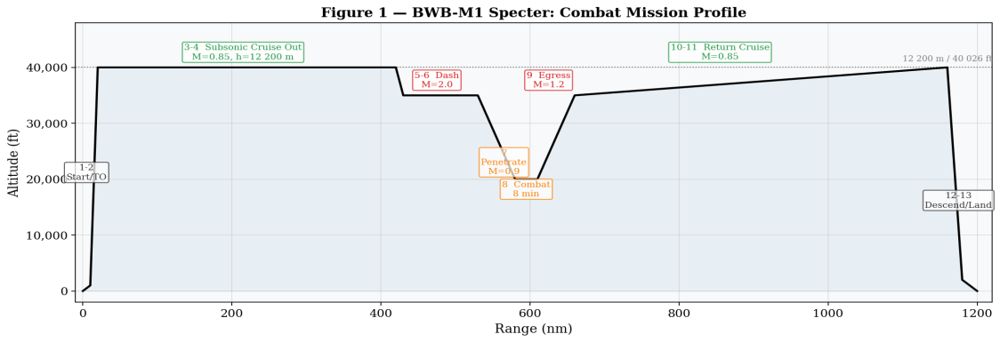
*Figure 1: BWB-M1 Specter, 13-segment combat mission profile. Altitude in ft, range in nm.*

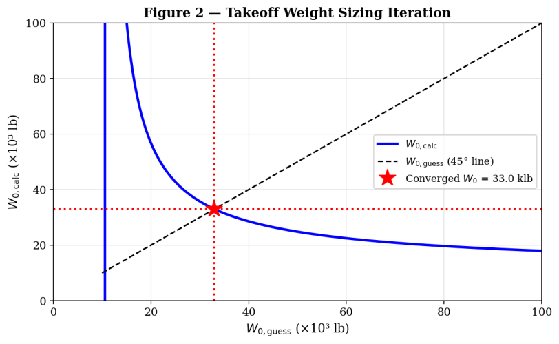
*Figure 2: Takeoff weight sizing iteration convergence. The intersection gives W0 = 32,988 lb.*

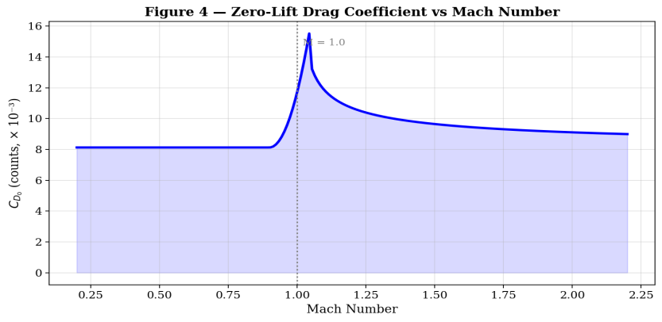
*Figure 3: Zero-lift drag coefficient CD0 vs. Mach number.*

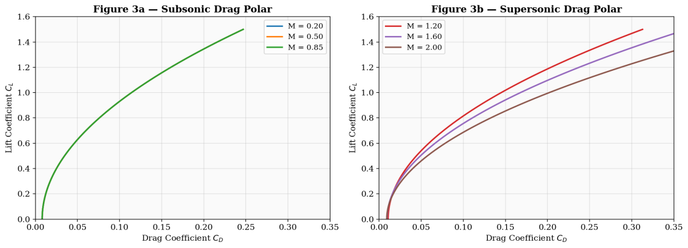
*Figure 4: Drag polars at subsonic (left) and supersonic (right) Mach numbers.*

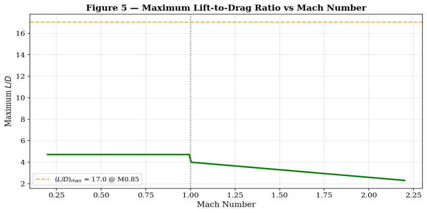
*Figure 5: Maximum L/D vs. Mach number. Subsonic efficiency is high; supersonic degradation is severe.*

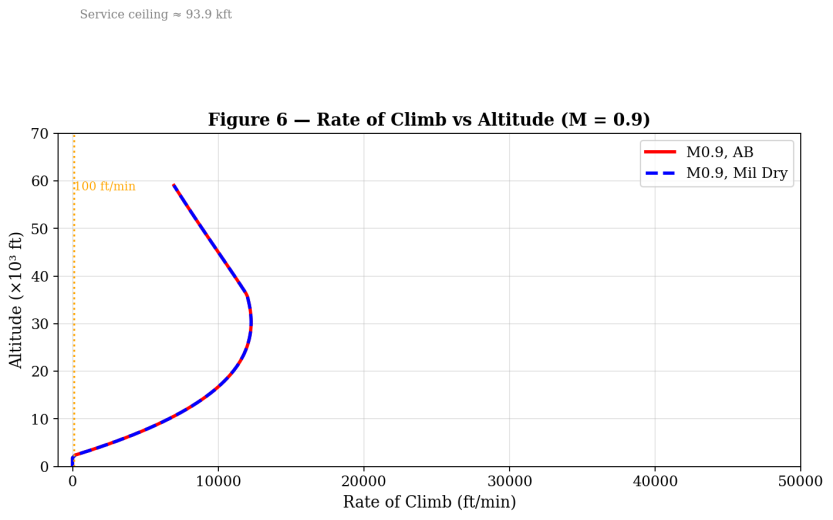
*Figure 6: Rate of climb vs. altitude at M = 0.9, MTOW, with afterburner (solid) and dry power (dashed).*

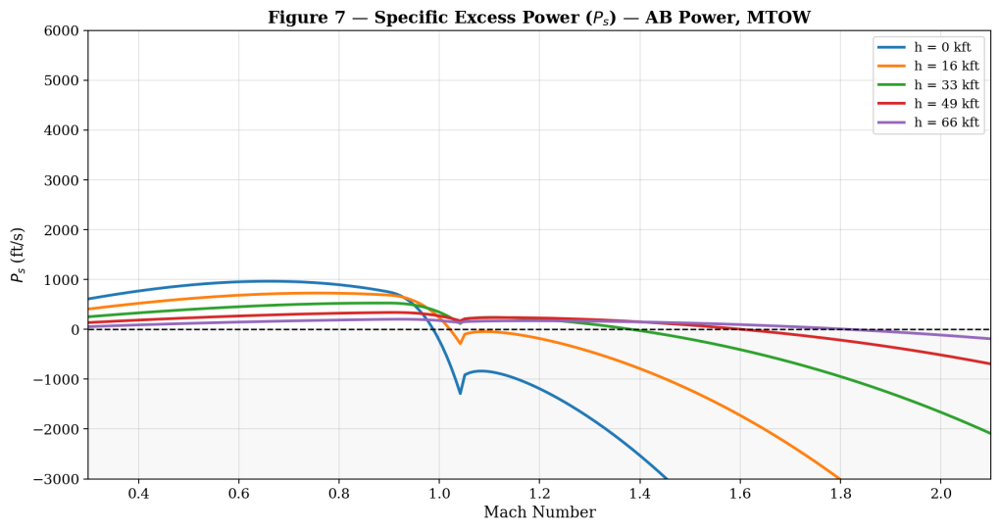
*Figure 7: Specific excess power Ps [ft/s] vs. Mach number at multiple altitudes, afterburner, MTOW.*

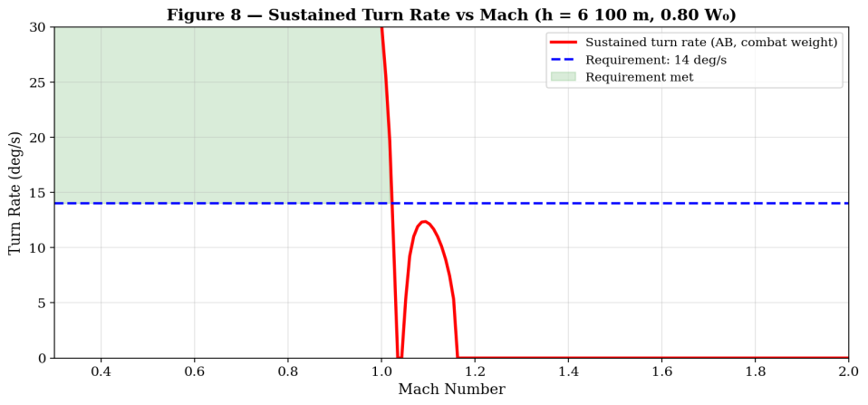
*Figure 8: Sustained turn rate vs. Mach number (h = 6,100 m, 0.80 W0, afterburner). The shaded region indicates compliance with the 14 deg/s requirement.*

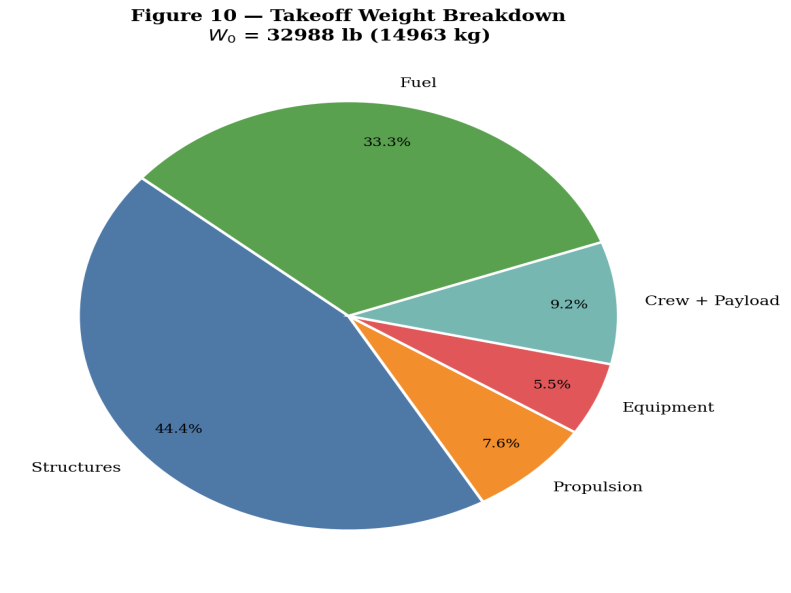
*Figure 9: Takeoff weight breakdown. W0 = 14,963 kg.*

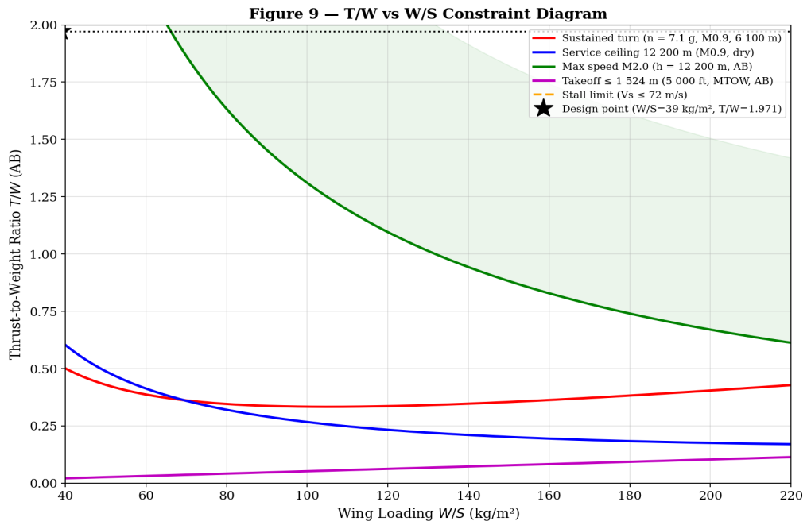
*Figure 10: T/W vs. W/S constraint diagram with the design point (star).*

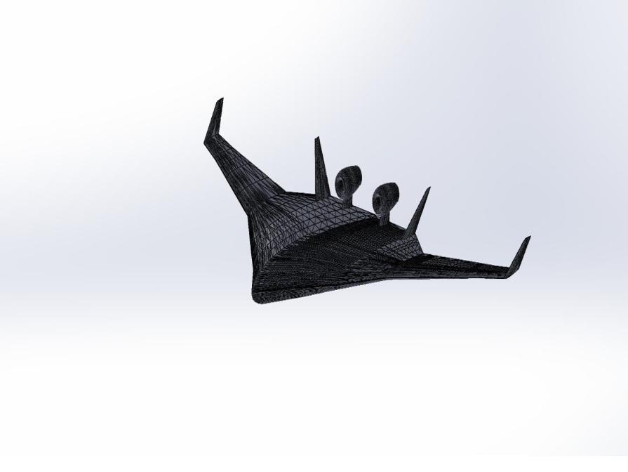
*3D model of the BWB-M1 Specter (modified Boeing X-48 geometry with twin dorsal engines and twin vertical stabilizers).*

## Repository contents
| Path | Content | Opens with |
|:--|:--|:--|
| `report/BWB_M1_Specter_Report.pdf` | Conceptual design report (20 pages) | Any PDF reader |
| `slides/AE405_Slides.pdf` | Presentation slides | Any PDF reader |
| `tools/cad/STL_File_Sergio_Jorge_Koutar_3dprint.STL` | STL model prepared for 3D printing | GitHub's STL viewer, SolidWorks, Blender, any slicer (e.g. Cura, PrusaSlicer) |
| `tools/cad/STL_File_Sergio_Jorge_Koutar_cfdanalysis.STL` | STL model prepared for CFD analysis | SolidWorks, Ansys SpaceClaim / Fluent meshing, Blender |
| `figures/` | 3D model renders and report figures | Image viewer |

## How to reproduce
No analysis code is included. All equations, inputs and intermediate values (mission-segment fractions, sizing iteration, drag buildup, performance calculations) are written out in the report, Sections 3–10, and follow Raymer (2018). The STL files can be opened directly for inspection, 3D printing or CFD meshing.

## Team and my contribution
Team of three: **Sergio San Juan Alonso**, **Jorge González Martínez** and **Kaoutar Ammara**. Instructor: Abbasali Saboktakin.

My sections:
- mission analysis and fuel fractions
- takeoff weight sizing
- wing geometry
- propulsion system
- aerodynamic analysis
- performance analysis
- weight breakdown

## References
Main references cited in the report: Raymer, *Aircraft Design: A Conceptual Approach*, 6th ed. (AIAA, 2018); Liebeck, "Design of the blended wing body subsonic transport", *Journal of Aircraft* 41(1), 2004; Boeing / NASA Dryden, X-48B/C BWB demonstrator program. The full list is in the report.

Kaoutar Ammara · Aerospace Engineer · [GitHub](https://github.com/Kiwiiiieee) · [LinkedIn](https://linkedin.com/in/kaoutar-ammara)
